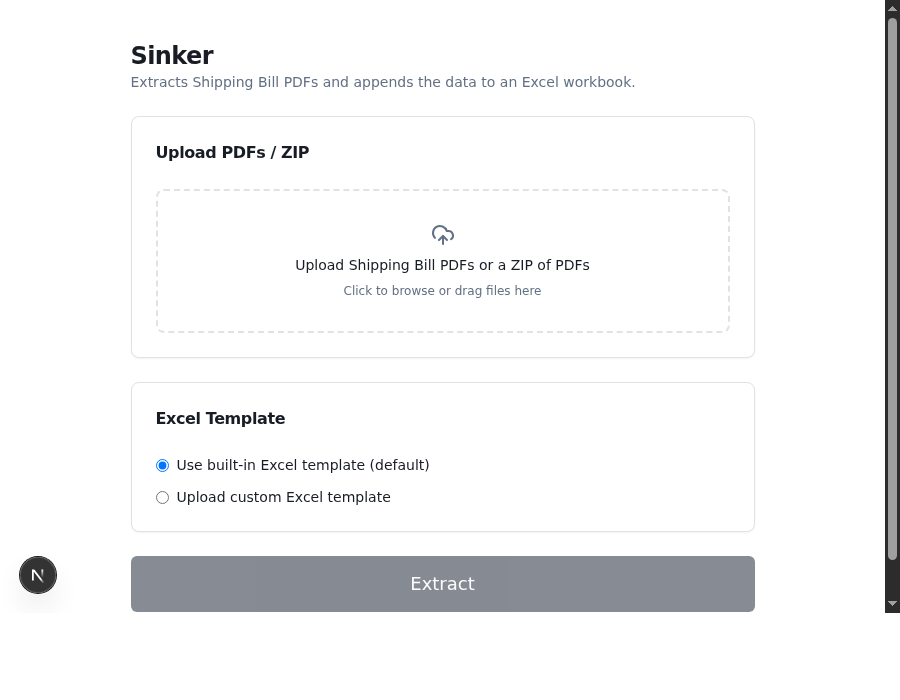

# Sinker — User Manual

Sinker reads your Shipping Bill PDFs and adds the information from them as
new rows in an Excel file. You upload PDFs, click one button, and download
the updated Excel file.



## Opening the app

1. Open the project's GitHub page (the link you were sent).
2. Click the green **Code** button, then the **Codespaces** tab.
3. Click **Create codespace on main**.
4. Wait about 1–2 minutes. A page will open that looks like a code editor —
   that's normal, you don't need to touch any code.
5. At the bottom of that page, find the box labeled **Terminal** and click
   inside it.
6. Type:
   ```
   npm run dev
   ```
   and press Enter.
7. Wait about 10 seconds. A small window should pop up in the corner asking
   to open a preview, or a new browser tab will open by itself — click
   **Open in Browser** if you see that option. This is the app.

You only need to do steps 2–6 once per Codespace. If you come back later and
your Codespace is still there, you can skip straight to opening it and
typing `npm run dev` again if the app isn't already running.

## Using the app

### 1. Upload your PDFs

Click the box that says **"Upload Shipping Bill PDFs or a ZIP of PDFs"**, or
just drag your files onto it. You can select:

- Several PDF files at once, **or**
- One ZIP file containing your PDFs

If you picked the wrong file, click **Remove** next to it in the list.

### 2. Choose a template

- **Use built-in Excel template (default)** — leave this selected the first
  time you use Sinker.
- **Upload custom Excel template** — use this if you already have an Excel
  file from a previous Sinker run (or one with the same column layout) that
  you want to keep adding rows to.

### 3. Click Extract

Click the big **Extract** button. While it runs, you'll see:

- **PDFs Found / Processed / Errors** — how far along it is
- **Rows Appended / Rows Skipped** — new rows added vs. rows that were
  already in the workbook (so nothing gets duplicated)
- A **Log** at the bottom listing every file as it finishes, and whether it
  succeeded or failed

This can take anywhere from a few seconds to a few minutes depending on how
many PDFs you uploaded.

### 4. Download your results

When it finishes, a **Summary** appears with totals, and two buttons:

- **Download Updated Workbook** — always appears. This is your Excel file
  with the new rows added.
- **Download Error Report** — only appears if one or more PDFs couldn't be
  read. Open it to see which files failed and why.

That's it — save the downloaded Excel file wherever you keep your records.

## Doing this again later (adding more PDFs)

Sinker doesn't remember anything between runs — the Excel file you download
*is* the record. So next time you have new PDFs to add:

1. Open the app again (see "Opening the app" above).
2. Upload your **new** PDFs.
3. Choose **Upload custom Excel template**, and upload the workbook you
   downloaded last time.
4. Click **Extract**.

Sinker will skip any rows that are already in that workbook and only add
the new ones — you won't get duplicates even if you accidentally include a
PDF you already processed before.

## Troubleshooting

**A file shows "FAILED" in the log.**
Open the downloaded Error Report — it lists the filename and the reason
(usually the PDF is a scanned image with no selectable text, or the file is
damaged). Sinker never guesses at values, so a PDF it can't read text from
simply can't be processed. Other files in the same upload aren't affected.

**Some fields are blank in the Excel file.**
Sinker only fills in a value when it can find it clearly labeled in the
PDF. If a field is blank, that label wasn't found in that particular PDF —
nothing was guessed. Let whoever maintains Sinker know which field, so the
underlying pattern list can be improved.

**The Extract button is grayed out.**
You need to have at least one file uploaded, and if you chose "Upload
custom Excel template" you also need to upload that template file.

**My Codespace disappeared / I can't find it again.**
On the GitHub repo page, click **Code** → **Codespaces** tab — any
Codespace you've created before will be listed there to reopen.
